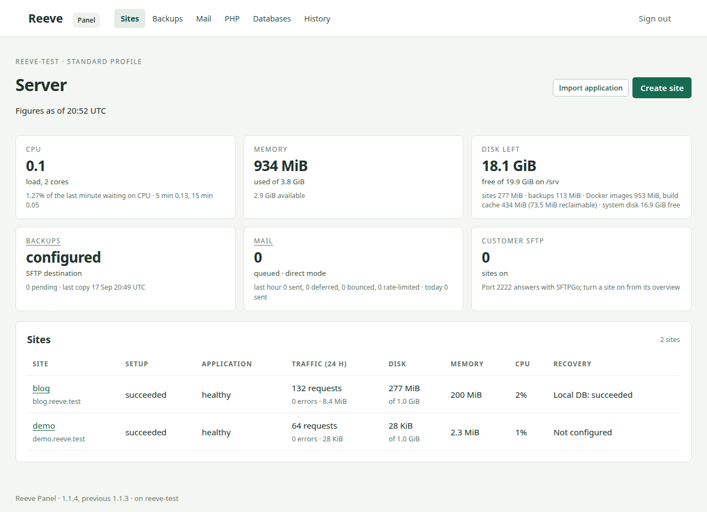
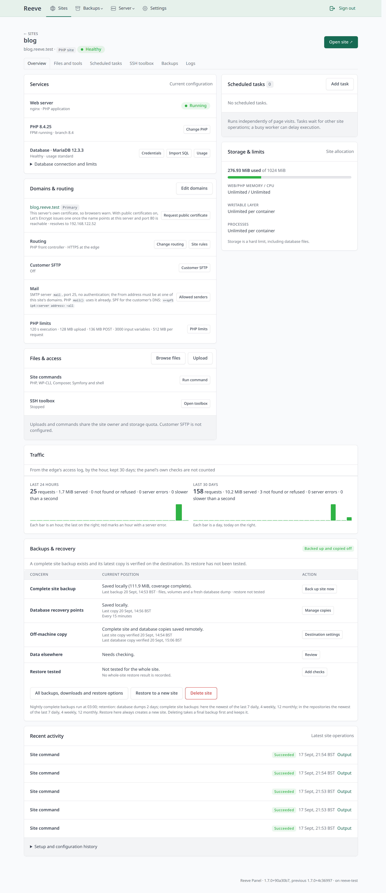

# Reeve

Reeve is a hosting panel for a single Debian server. It manages static sites, PHP sites
and Docker Compose applications, with databases, backups and file access from a web interface.

- Create sites with their own containers, domains and disk quotas.
- Choose a PHP version and an optional MariaDB, MySQL or PostgreSQL database.
- Upload files, use SFTP and run site tools or scheduled commands.
- Back up sites locally and to SFTP or Amazon S3; restore one site, roll a live site back, or
  rebuild a whole server from its repository.
- Monitor server resources, site health, traffic, logs and outgoing mail.
- Put administration behind WireGuard and close every other port with one setting.

Reeve targets Debian 13 on amd64, with Docker and XFS project quotas. The installer sets up
these dependencies. Administration is through an SSH tunnel, or through the WireGuard tunnel
Reeve makes for itself in secure mode.

## Documentation

- [Install](docs/install.md) — set up a server and sign in.
- [Host a Compose application](docs/compose.md) — prepare an application, package its data and deploy it.
- [Operate](docs/operate.md) — manage sites, backups and updates.
- [Recover](docs/recover.md) — restore sites, roll one back, or rebuild a server from its backups.
- [Design](docs/design.md) — understand the architecture.
- [Decisions](docs/decisions.md) — understand the main engineering constraints.
- [Develop](docs/develop.md) — run tests and prepare changes.

## Project status

Reeve is being tested with real workloads on a public server. Sites use the edge's own
certificate authority until public certificates are switched on in Settings; Let's Encrypt,
the firewall and WireGuard administration are proven on a public address. Outgoing mail
delivery depends on the provider allowing port 25 and on reverse DNS.

No licence has been selected. All rights reserved.
