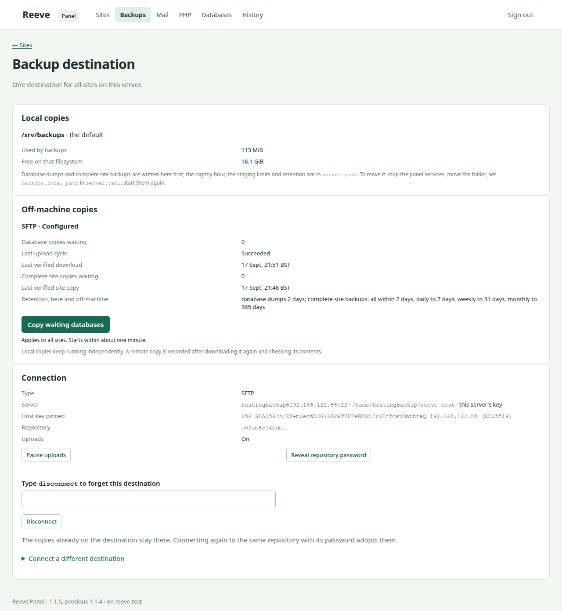

# Install

This guide installs Reeve on a Debian 13 server and opens the panel through SSH.

## Requirements

- A minimal Debian 13 amd64 installation, with at least 2 GB of RAM.
- An administrator account with SSH key access and sudo, not root itself. See
  [If you only have root](#if-you-only-have-root).
- Access to Debian and Docker package repositories and container registries.
- Somewhere for the data: a separate partition or volume is best; a single-disk server works
  too. See [Where the data lives](#where-the-data-lives).

The installer sets up Docker, XFS project quotas and the panel services. An existing Docker
installation must use rootful overlay2 with its data under `/srv/docker`.

## If you only have root

Many providers hand over a server with an SSH key on `root` and no other account. Logged in
as root, create the administrator, give it your key and a password for sudo, then close root
logins:

```sh
apt-get install -y sudo
adduser admin
usermod -aG sudo admin
mkdir -m 700 /home/admin/.ssh
cp /root/.ssh/authorized_keys /home/admin/.ssh/
chown -R admin:admin /home/admin/.ssh
```

Check `ssh admin@server` and `sudo -v` work from a second terminal before continuing. Then
add `PermitRootLogin no` and `PasswordAuthentication no` to `/etc/ssh/sshd_config.d/local.conf`
and run `systemctl restart ssh`. Use the new account for everything below.

## Install Reeve

The example below installs release `v1.5.2`.

```sh
sudo apt-get install -y git
git clone https://github.com/tompowellweb/reeve.git
cd reeve
git checkout v1.5.2
sudo python3 install.py
```

The installer asks where the site data should live, listing the empty disks and partitions it
finds and an image file on the root filesystem. **The device you choose is formatted.** Keep the
operator password printed at the end of installation.

## Where the data lives

Reeve keeps sites, databases, Docker and local backups under `/srv` on an XFS filesystem with
project quotas, which is how each site gets a hard disk limit. Three ways to provide it, best
first:

1. **A separate partition or volume.** When installing Debian, give the root 15–20 GB and leave
   the rest for a second partition; or attach a block storage volume from your provider. The
   installer offers it if it is empty: a device carrying a filesystem or partition table is not
   listed, so wipe a spare one first with `wipefs -a`. Without a terminal, `--data-device` names it.
2. **An image file on the root filesystem**, for a VPS with one disk and no volume. The installer
   offers to create `/var/lib/reeve/srv.img` as XFS and mount it at `/srv`. It takes 80% of the
   root's free space by default and always leaves the system at least 10 GB; `--data-percent 60`
   changes the share and `--data-image` says yes without a terminal. The cost is one extra
   filesystem layer and a little throughput. To grow it later:

   ```sh
   sudo truncate -s +20G /var/lib/reeve/srv.img
   sudo losetup -c "$(findmnt -no SOURCE /srv)"
   sudo xfs_growfs /srv
   ```

   Keep the root filesystem from filling up under the image; the home page warns below 10 GB.
3. **An XFS filesystem you mounted at `/srv` yourself.** It is adopted, and the `prjquota`
   option is added if missing; follow any reboot instruction. An empty non-XFS `/srv` is
   formatted after you say yes.

The installer refuses devices with existing signatures and does not partition disks. Shrinking
a full-disk root needs the provider's rescue system and `resize2fs` offline; it does not do that.

## Sign in

On your own computer, open an SSH tunnel:

```sh
ssh -N -L 127.0.0.1:8088:127.0.0.1:8088 admin@server
```

The installer prints this command with your account and the server's address. Open
[http://127.0.0.1:8088](http://127.0.0.1:8088) and enter the operator password.
The panel listens on the server's loopback address until secure access gives it a WireGuard
address; either way it is never on the public address.

To change the password, run this on the server:

```sh
sudo reeve password
```

## Before adding sites



Open **Settings** and choose the server profile that matches the machine (`small` for
2–4 GB).

Connect a backup destination on the **Backups** page and keep its recovery card outside the
server. See [Operate](operate.md) for mail settings, site creation and updates.

Sites get certificates from the edge's own certificate authority until you switch to public
ones on **Settings**, once the sites' names point at this server and ports 80 and 443 are
reachable from the internet. A name whose DNS does not point here yet is served with the
edge's own certificate until it does; each site's **Domains** section says which kind every
name has. On a public server, turn on **Secure access** on Settings once you can reach the
panel: it puts administration behind WireGuard and closes every other port. Outgoing mail
delivery still needs arranging.

