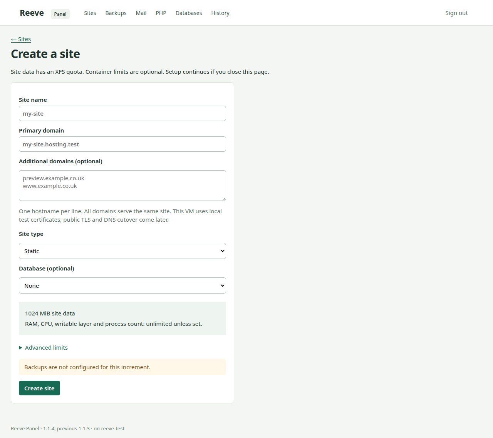
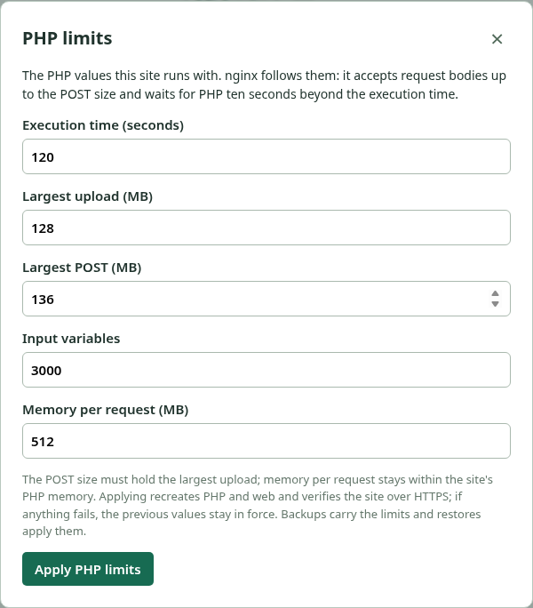
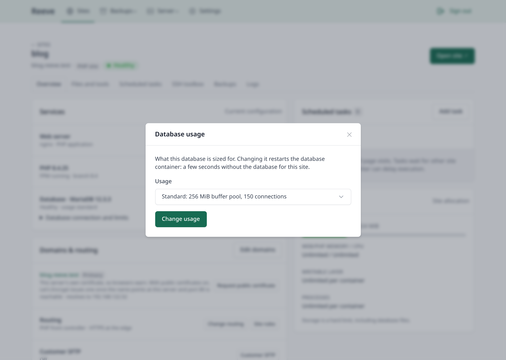
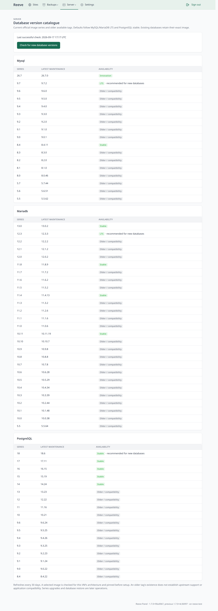
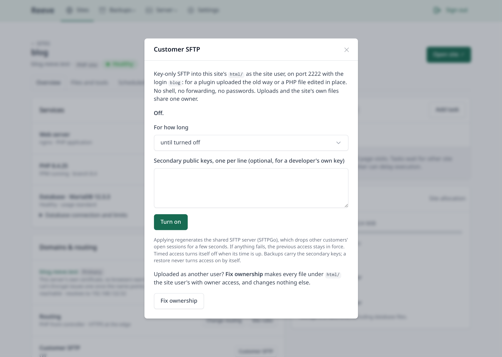
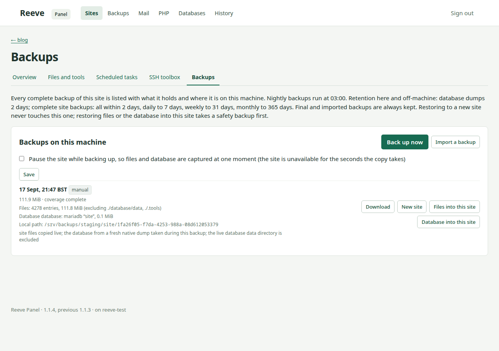
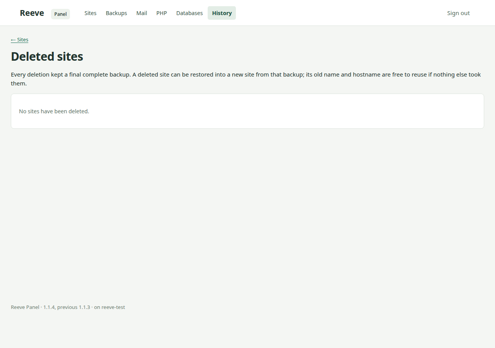
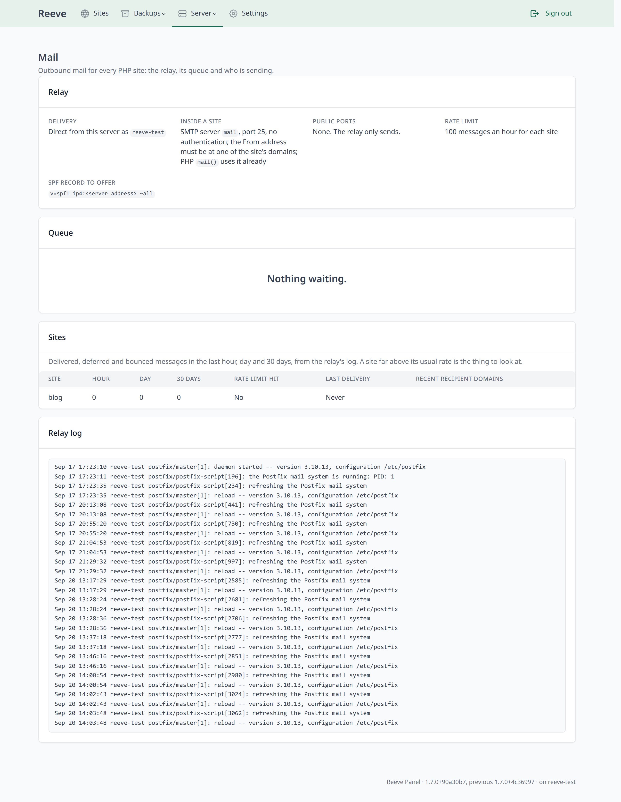
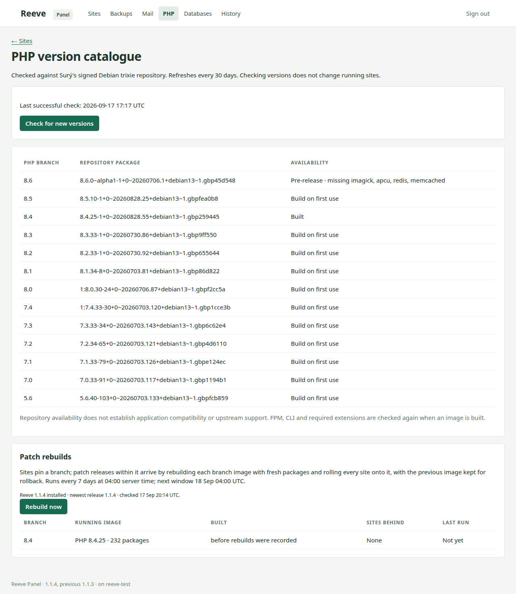

# Operate

Use the panel for everyday administration. The commands below run on the server and provide
shortcuts for common tasks. Use `sudo reeve --help` for the full command list.

## Check the server

The home page shows resource use, backup status, mail and the sites on the server.
Each site shows its health, traffic and disk usage against its quota. Check the timestamp
on the figures: the page can display the last collected summary while the worker is busy.

## Deploy a Compose application

Use **Import application** for an application with its own Docker Compose setup. Reeve
builds or pulls its images, restores supplied database dumps, and routes a hostname to its
HTTP service. Uploading the project reviews it; deployment is a separate step.

[Host a Compose application](compose.md) walks through preparing the folder, including
configuration and existing data, creating the archive, and deploying it. It includes a
complete WordPress/MariaDB example and explains the supported formats and current limits.

## Create a managed static or PHP site



Choose **Create site**, enter a name and hostname, then select static or PHP hosting.
For PHP, choose a branch and optionally a database. Set the disk quota and any resource limits.

```sh
sudo reeve site create example example.com --alias www.example.com
sudo reeve site create shop shop.example.com --runtime php --php-version 8.4 --database mariadb
sudo reeve site list
```

Creation continues if you close the page. If it fails, read the operation's output before
using **Retry setup**. Site content lives at `/srv/sites/<name>/html`.

## Change domains, PHP or databases





**Domains** replaces the complete hostname list; put the primary name first and include
every alias you want to keep. The names and the edge's routes change at once; certificates
follow, and the section shows each name's certificate, what it resolves to and, when Let's
Encrypt refused, what it said. **Request public certificate** asks again now rather than at
the local certificate's renewal, once the name points at the server. **Site rules**
accepts nginx redirects and routing rules; Reeve checks the configuration before applying it.

```sh
sudo reeve site domains shop shop.example.com www.shop.example.com
```

Use **Change PHP** to switch branches and **PHP limits** to adjust memory, uploads and
timeouts. Test the application after switching; container health does not prove compatibility.
The previous runtime is available for rollback.

```sh
sudo reeve php switch shop 8.3
sudo reeve php rollback shop
```

A managed site can have one MariaDB, MySQL or PostgreSQL server. **Credentials** shows its
application login; PHP receives the connection settings as `DATABASE_*` variables.
Changing database usage restarts that database briefly. PHP 7.0 and 7.1 sites using MySQL
require the 8.0 series with legacy authentication, or use MariaDB.



## Files and access



Use **Files and tools** to upload files or archives, edit text, import a single-database SQL
dump, and run PHP, Composer, WP-CLI or shell commands. Uploads are limited to 512 MiB.
**Scheduled tasks** runs site commands at intervals without overlapping runs.
Use **Fix ownership** after uploading content as an administrator.

**Customer SFTP** provides key-only access to the site's content on port 2222, using the
site name as the login. Enable it on the site page, save the generated key or add a developer's
public key, and turn it off when no longer needed.

The **SSH toolbox** provides a shell through the server's SSH connection. Stop the toolbox
before making other changes to the site.

## Backups and restores



Connect one or more destinations on the server's **Backups** page, SFTP, Amazon S3 or a folder,
then show the **recovery card** and keep it in a password manager: it holds every destination's
address, host keys, credentials and repository password, everything a replacement server needs,
in one file.

The default schedule is:

| Backup | Frequency | Retention |
| --- | --- | --- |
| Database dump | Every 15 minutes | Two days |
| Complete site backup | Nightly | Here: the newest two dailies (about three times a site's size on disk) |
| Copy to every destination | Hourly | In each repository: the newest of the last 7 days, 4 weeks and 12 months |

**Destinations** on the Backups page are restic repositories, any number of them: an SFTP server
(a NAS, another box), an Amazon S3 bucket, or a folder this server can reach: under
`/srv/backups/repositories` on its own data disk, or under `/mnt` or `/media` for another disk
or a mounted share. Give each a name. Every complete backup and dump is copied to each
hourly and recorded only after being downloaded again and checked; each destination can be
paused, copied to now, or disconnected on its own. A repository on this server's own disk keeps
a deduplicated history cheaply and speeds restores, but dies with the server; a mounted share is
an off-machine copy like any other. The recovery card carries every destination.

Complete backups contain site files, volumes, a fresh database dump and site settings.
Enable pausing during backup when the application needs writes stopped for a consistent copy.
Retention is by count, as restic phrases it: the newest backup of each of the last so many days,
weeks and months that have one, with separate counts for the copies here and for the repositories.
Zero turns a tier off; one daily is the minimum, so the hourly copy always has something to take,
and a copy here that a destination has not received yet is never removed. Tightening the counts
asks first, saying how many backups and how much space would go, and lets you keep the existing
ones instead; those are then marked kept. Final backups from deleted sites, imported backups and
kept backups do not expire; let them go on **Recover → Manage** when they are no longer wanted.
The nightly hour, the counts and the local folder (`/srv/backups` by default) are on **Settings**. A server
record, the settings and every site's hostnames and latest backup, is copied to every repository
beside the backups, so a replacement server can find what was hosted.

A site's **Backups** page offers download, import, restore to a new site, and restore of
files or a database into the current site. Restoring into the current site takes a safety
backup first. **History** lists deleted sites and their retained backups. **Recover** works
across sites: scan a repository, a folder or this server's copies, then restore several sites
at once or roll a live site back to a chosen backup or database dump.

```sh
sudo reeve site backup shop
sudo reeve site backups shop
sudo reeve backup status
sudo reeve backup copy
```

See [Recover](recover.md) for a replacement server. Check that remote copies succeed and
rehearse a restore before relying on them.



## Outgoing mail



PHP sites send through the shared relay using `mail()` or SMTP at `mail:25`.
Use **Allowed senders** for sender domains beyond the site's hostnames. The **Mail** page
shows the queue, delivery failures and per-site counts.

On **Settings**, outbound mail is `direct`, `relay` to a smart host, `sink` for testing, or
`off`; set the server's mail hostname and public address there too, and the relay is
redeployed. `sudo reeve mail setup` does the same from the command line.

Direct delivery also needs three things outside Reeve: the provider must allow outbound port 25
(some cloud providers block it by default), the server's reverse DNS must match the mail
hostname, and each sending domain needs the SPF line the site page prints. Without them,
messages sit in the queue as deferred or land in spam.

## Logs

A site's **Logs** page shows the last lines its containers wrote (nginx, PHP, the database, or
every service of a Compose package) and the edge's access log for its hostnames, with a time
window and a text filter. A page that answers 500 has its reason in the PHP or web server
output; PHP errors are never shown on the pages themselves.

## Server settings

**Settings** holds what the server does for every site: certificates (the edge's own
authority or Let's Encrypt), outbound mail, the server profile, backup times and retention,
and the PHP rebuild schedule. Each Save applies at once and says what it did. The same from
the command line: `sudo reeve settings show` and `sudo reeve settings set <group> key=value`.

## Secure access

**Settings → Secure access** puts administration behind WireGuard and closes the server to the
internet except for the sites (80, 443), customer SFTP (2222) and the tunnel's UDP port, on
IPv4 and IPv6. Three steps, in order:

1. **Enable WireGuard.** The server makes its keys and a first client configuration, shown once
   with a QR code and kept on the server. Import it into WireGuard on your computer or phone and
   connect. Nothing is blocked yet except the panel port from outside; the panel now also answers
   on the tunnel address, so the SSH forward is no longer needed.
2. **Lock down.** Offered once the page is opened over the tunnel and a client has a live
   handshake, so the path you are about to depend on is proven first.
3. **Confirm** within fifteen minutes, from over the tunnel, or the lockdown reverts by itself.

sshd is unchanged: 22 keeps listening and works over the tunnel. A provider firewall, if any,
must allow the UDP port. **Reveal unlock token** shows a single-use break-glass address: if the
tunnel is lost, request it from the machine you want to admit and port 22 opens to that address
for thirty minutes; the page shows it with a button to close it, and issues a new token.

## Updates



Reeve reports new releases but installs them only when requested:

```sh
sudo reeve update --check
sudo reeve update
```

If the command itself cannot run, update from your checkout instead: `git fetch --tags`, `git
checkout vX.Y.Z`, `sudo python3 install.py`.

Use `sudo reeve update --to <version>` for a specific release, including a compatible
previous version. An update restarts the panel services; it does not roll back site content.

PHP patch rebuilds run weekly by default, with verification and a previous image retained
for rollback. Mail and SFTP images are also rebuilt in that cycle. PHP branch changes,
database series changes, application code and Compose application images require operator action.

## Troubleshooting

Read the site's recent activity and the failed operation's output first.

- **Recovery needed:** an operation was interrupted. Inspect the site and job output before
  retrying. Content imports and site commands are not replayed automatically.
- **Unhealthy site:** identify whether web, PHP or the database failed on the site page.
- **Quota full:** remove unneeded content or deliberately increase the quota.
- **Missing proxy route:** `sudo reeve doctor --repair` rebuilds the proxy from recorded routes.
- **A page answers 500:** the site's **Logs** page, source PHP, has the error.
- **A name has no public certificate:** the Domains section shows what Let's Encrypt said;
  **Request public certificate** asks again once DNS and ports are right.
- **Locked out after secure access:** request the unlock address shown by **Reveal unlock
  token** from the machine you want to admit; port 22 opens to it for thirty minutes.

```sh
sudo reeve status
sudo journalctl -u reeve-worker -u reeve-web -n 100 --no-pager
```
